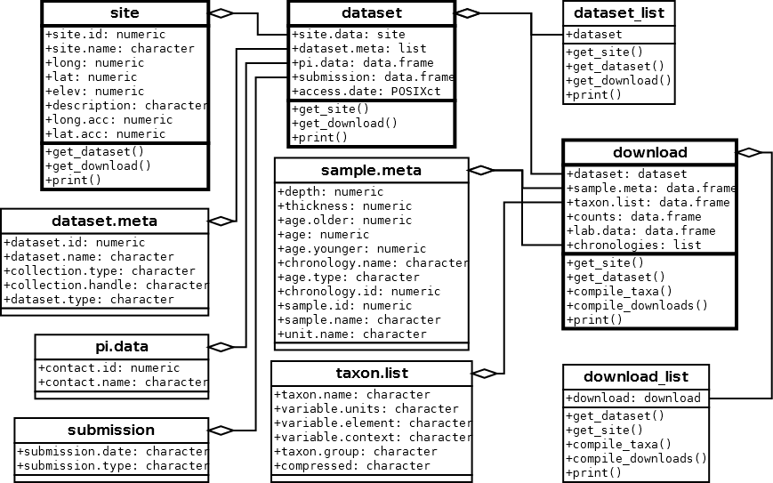

neotoma: A Programmatic Interface to the Neotoma Paleoecological Database
========================================================

<!--

```{r setup-knitr, echo = FALSE, message = FALSE}
# Simon: Note that these are global options that apply to all chunks below.
knitr::opts_chunk$set(
  comment = " ",
  error = FALSE,
  # Note: I have set EVAL to false just to make the bib work. 
  # Once the bib is fixed, you'll set this to TRUE or just delete this line.
  eval = TRUE,
  cache = TRUE,
  tidy = FALSE
  # Note to @gavinsimpson, I think this is now a knitr issue.
  # I'll file a bug PR with knitr
)


library(pander)
library(plyr)
panderOptions('table.style', 'rmarkdown')
```
-->


Abstract:
-------------------

Paleoecological data are integral to ecological analyses.  First, they provide an opportunity to study ecological and evolutionary interactions between communities and abiotic environments at time scales ranging from subdecadal to millennial or longer. Second, they allow us to study ecological processes that occur infrequently, such as megadroughts, hurricanes, rapid climate change and volcanic eruptions. Third, we can use the past to understand ecological processes in the absence of widespread anthropogenic influence.

The R package `neotoma`, described here, obtains and manipulates data from the Neotoma Paleoecological Database (Neotoma Database: [http://www.neotomadb.org]()). The Neotoma Database is a public-domain searchable repository for multiproxy paleoecological records spanning the past 5 million years and multiple taxonomic groups. It provides the cyberinfrastructure  to study the spatiotemporal dynamics of species and community distributions from the Pliocene to the present. `neotoma` provides a user interface to enable this study. The package searches the Neotoma Database for datasets using search keys that can include location, taxon name, or dataset type (e.g., pollen, vertebrate fauna, ostracode) using the database's Application Programming Interface (API). The package returns a set of nested metadata associated with the site, including the full assemblage record, geochronological data to enable rebuilding of age models, metadata for the dataset (e.g. age range of samples, date of accession into Neotoma, principal investigator), and site metadata (e.g. location, site name and description). `neotoma` also provides tools to allow cross-site analysis, including the ability to standardize taxonomies using built-in taxonomies derived from the published literature or user-provided taxonomies.

To assist with the use of the neotoma package we provide examples of key functions based on the published literature, for both plant and mammal taxa.

Introduction
--------------------

Paleoecological data are fundamental to understanding the patterns and drivers of biogeographical, climatic, and evolutionary change, ranging from the recent past to the dawn of life.  Although individual site-level studies have provided fundamental insights into past ecological dynamics, the true power of paleoecological data emerges from networks of paleoecological data assembled to study broad-scale ecological and evolutionary phenomena, e.g. the responses of speciation rates to the five major extinction events in geological history [peters2001biodiversity; raup1984periodicity; sepkoski1997biodiversity] and the rapid and individualistic responses of species to the climate changes accompanying recent glacial-interglacial cycles [@davis1981quaternary; @schroeder1996spatial; @huntley1988vegetation; @tzedakis1994vegetation; @williams2004late].  Paleoecoinformatics [@brewer2012paleo; @uhen2013card] is dedicated to providing tools to researchers across disciplines to access and use large paleoecological datasets spanning thousands of years.  These datasets may be used to provide better insight into regional vegetation change [@blois2013modeling; @blarquez2014disentangling], patterns of biomass burning [@marlon2013global], or changing rates of geophysical processes through time [@goring2012depo]. The increasing interest in uniting ecological and paleoecological data to in order to better understand responses to a rapidly changing world [@fritz2013diversity; @behrensmeyer2012building; @dietl2011conservation] will require more robust tools to access and synthesize  data from the modern and paleo time domains.

The Neotoma Paleoecological Database represents a consortium of paleoecological databases, with distributed scientific governance and expertise, but sharing a common database infrastructure. Constituent databases include, among others, the large European,  Latin American, and  North American Pollen Databases; the North American Plant Macrofossil Database; FAUNMAP (Pliocene to Quaternary mammal fossils in the  United States and Canada); the North Dakota State University Fossil Insect Database; the North American Non-Marine Ostrocode Database; and the Diatom Paleolimnology Data Cooperative. Neotoma is the outgrowth of a longstanding collaboration between the European Pollen Database and the North American Pollen Database [@grimm2013databases] and the desire to integrate these data with faunal and other paleo data. The database framework was generalized from the pollen databases (which had identical structures) and the FAUNMAP database to accomodate both macro- and microfossil data as well as other kinds of data such as  geochemical, isotopic, and  loss-on-ignition. Work is underway to include other taxonomic groups and depositional contexts (e.g.  testate amoeba records, packrat midden data), thus further expanding the data that can be accomodated by Neotoma. Crucially, Neotoma is a vetted database.  Through the use of data stewards - domain experts distributed among constituent bases who can check for inaccuracies, upload and manage data records - Neotoma can support high qualitycontrol assurance for each of the constituent data types, and receive feedback from research communities involved with each specific data type [@grimm2013databases].

The Neotoma Database has also developed Application Programming Interfaces that allow users to query the database via web services, which return data using properly formed URL requests. For example, the URL: [http://api.neotomadb.org/v1/apps/geochronologies/?datasetid=8]() will return all geochronological data for the record associated with the queried dataset ID (here, Dataset ID = 8).

The analysis of paleoecological data is commonly performed using the statistical software R [@RCoreTeam2014], and several paleoecological packages in R  packages are designed specifically for paleoecological dataexist, for analysis including  `analogue` [@analogue2014; @analogue2007] and `rioja` [@rioja2013] for paleoenvironmental reconstruction, `Bchron` for radiocarbon dating and age-depth modeling [@bchron2014] and `paleofire` to access and analyse charcoal data [@blarquez2014paleofire]. Given the rapid proliferation and availability of these analytical tools in R, the rate-limiting step has become the difficulty of obtaining and importing data into R.  This bottleneck has meant reliance on datasets such as those from the NOAA Paleoclimate Repository or the North American Modern Pollen Database, and on more *ad hoc* methods such as the distribution of individual datasets from author to analyst.

With an increasing push to provide ecological publications that include numerically reproducible results [@goring2013pollen; @goring2012depo; @wolkovich2012advances; @reichman2011challenges] it is important to provide tools that allow analysts to directly access dynamic datasets, and to provide tools to support reproducible workflows. The rOpenSci project is dedicated to developing tools using R to facilitate a culture shift toward reproducible science in the ecology comunity.  As part of this effort, it has provided a number of tools that can directly interact with application programmatic interfaces (APIs) to access data from a number of databases including `rfishbase` for FishBase [@boettiger2012rfishbase], and `taxize` for the Encyclopedia of Life, iPlant/Taxosaurus and others [@chamberlain2013taxize] among others.

The `neotoma` package addresses concerns regarding data access and workflow reproducibility by providing users with tools that allow paleoecologists to query, download, organize, and summarize data from the Neotoma database using R. Here we describe the `neotoma` package, then we present use cases for the `neotoma` package, using examples drawn from the ecological literature, with the general objective of illustrating how `neotoma` provides tools to perform paleoecological research in an open and reproducible manner.

The `neotoma` package
---------------------------
`neotoma` R package is an interface between the Neotoma Paleoecological Database ([http://neotomadb.org]()) and statistical tools in R.  `neotoma` uses an API to send data requests to the Neotoma Database, and then forms data objects that can interact with existing packages such as `analogue` [@analogue2014] and `rioja` [@rioja2013], which are used for environmental reconstruction, manipulation, and presentation of paleoecological data.  The `neotoma` package also includes tools to standardize pollen taxon names across sample sites using a set of commonly accepted pollen taxonomies for North America, or user defined taxonomies.


**Figure 1**. *Major classes in `neotoma`, their relations to one another and the associated functions.  The classes described below have a heavier outline than their associated variables.*

Data in the `neotoma` package is represented in three main classes (Figure 1): `"site"`s, `"dataset"`s (grouped into `"dataset_list"`s), and `"download"`s (grouped into `"download_list"`s). A `"site"` is the most basic form of spatial information representing the spatial locations of datasets along with site names, descriptions and a unique `site.id`. `"site"`s are `"data.frame"`s with columns `siteid`, `sitename`, `lat`, `long`, `elev`, `description`, `long_acc`, and `lat_acc`. These column headings are generally self explanatory; `long_acc` and `lat_acc` are used to indicate the width of the bounding box for a sample site (with a midpoint of `long` and `lat`).  In the Neotoma Database, examples of sites include a lake from which one or more cores are collected, a cave from which one or more faunal assemblages are collected,  an archaeological dig with one or more excavation pits, and so forth.  

Each row of the object returned by `get_site` represents a unique site, and provides enough descriptive data to plot site locations and understand the spatial extent of a site.  Using the class assignment `"site"` allows objects returned by `get_site()` to be recognized by other functions, so that site information can easily be used to obtain datasets or whole data downloads.  Sites, conceptually, are containers for datasets. Generally it's better to search for a neotoma dataset.  The `neotoma` package allows you to use almost all of the same search terms in `get_dataset()` as in `get_site()`, and returns a more complete description of the datasets available, however at this time `get_site()` is the only method by which you can search by site name.

Although `get_site()` is useful for first-pass surveys of data availability, analysts more commonly will want to to search for and retrieve datasets stored in the Neotoma Database.   `"dataset"`s associated with individual sites can be obtained using the `get_dataset()` method. In the Neotoma Database, a `"dataset"` is a set of samples  of the same type from a single collection unit within a site.  Examples of datasets in Neotoma include 1) all the pollen counts from a single core from a lake, 2) all the geochronological measurments (e..g radiocarbon dates)  from a sediment core, 3) all the faunal data  from an excavation in a cave, 4) all the plant macrofossil data from a packrat midden . In `neotoma`, a `"dataset"` is a special type of `"list"` that includes the `"site"` for each `"dataset"`, along with metadata for the particular `"dataset"` (`"dataset.meta"` in Figure 1), including the data type, the principal investigator, the submission date to Neotoma, and the date that the information was accessed from the Neotoma API using the R package. The `"dataset"` also includes a unique `"dataset.id"` that can be used to access the full `"download"` using the `get_download()` method.

`get_download()` returns an object of class `"download_list"` that contains objects of class `"download"`.  Both are `list`s, but the `"download_list"` is of a length equal to the number of records returned, while the `"download"` contains a fixed number of objects (Figure 1).  In most cases `get_download()` will return a confirmation for each individual API call as the function proceeds.  This can be turned off using the argument `verbose = FALSE`.  The `"download"` contains the associated `"dataset"` information (which itself has `"site"` information), but it also contains the full data object for the dataset it references (Figure 1).

Both the `get_download()` and `get_dataset()` functions record the date and time the API was accessed.  There is also a special `print()` function for `"download"`s and `"download_list"`s because of the large size of most objects to limit output size, however, `"download"`s and `"download_list"`s remain `list`s and can be manipulated as such in R.  

The `"metadata"` component is equivalent to a `"dataset"` returned by `get_dataset()`.  The `"sample.meta"` component is where the core depth and age information is stored. The actual chronologies are stored in `"chronologies"`.  If a core has a single age model then `"chronologies"` has a length of one. Some cores have multiple chronologies and these are added to the list. The default chronology is always represented in `"sample.meta"` and is always the first chronology. To build a new chronology with the same chronological controls as an existing chronology, but with a different algorithim, use `get_chroncontrol()` to return the chronology controls and the `"chronology.id"` in either `"sample.meta"` or any one of the `"chronologies"` objects. While the chronological controls used to build a chronology may vary across chronologies for a single site, the default model contains the “best” chronological control data, as determined at the time the chronologies for the collection unit were last reviewed. It is important to note, however, that the “best” chronologies for most collection units in the database were based on “classical” age models [@blaauw2010methods] that do not include estimates of uncertainty. Moroever, these default age models that are in calibrated radiocarbon years utilize radiocarbon dates that are calibrated a priori. Bayesian age modeling programs, such as Bacon [@blaauw2011flexible], which provides estimates of uncertainty, as well as the classical age modeling program clam [@blaauw2010methods], which also returns estimates of uncertainty, utilize uncalibrated radiocarbon dates as input. Thus, the calibrated ages of many existing age models in Neotoma will not be appropriate for these programs, and the age controls may have to be obtained from the Geochronology table. The age controls of existing default radiocarbon-year chronologies may sometimes be appropriate for programs such as Bacon and clam; however, many of these chronologies rejected radiocarbon dates *a priori*, which may not be appropriate for programs such as Bacon.  The `neotoma` package has a function to interface directly with Bacon or clam, called `write_agefile()`, which will output a correctly formatted age file for either of these applications using a `"download"` object.

The `taxon.list` component is a critical part of the `"download"` object.  It lists the taxa found in the core, as well as any laboratory data, along with the units of measurement and taxonomic grouping.  This is important information for determining which taxa make it into pollen percentages. The `counts` are the actual count or percentage data recorded for the core.  The `lab.data` component contains information about any spike used to determine concentrations, sample quantities and, in some cases, charcoal counts.


**Figure 2**. *How the main data objects relate to one another in the `neotoma` package, and the helper functions used to move from one data type to another.*

Each of these objects, `"site"`, `"dataset"` and `"download"` can be obtained using direct calls to the API, or using functions defined in the `neotoma` package (Figure 2).

Examples
------------------
Here we present several examples that both introduce users to the `neotoma` package, and highlight how `neotoma` can be used in a paleoecological worklfow. We beging with a simple example in which we compare change in Alnus between two sites, followed by two more involved examples where we look at Pine migration and mammal distributions.

### A simple example
A researcher is interested in finding the pollen record for Marion Lake, in British Columbia [@mathewes1973palynological] and comparing the change in Alnus pollen to pollen from Louise Pond [@pellatt1997holocene] on Haida G'Waii, further north.  We search for specific sites by name using `get_site()`, making use of the wildcard `"%"` to catch sites whose site names begin with `Marion Lake` or `Louise Pond`:

```{r load-pkgs-1-code, echo = FALSE, warning = FALSE, message = FALSE}
library("neotoma")
suppressPackageStartupMessages(library("analogue"))
library("knitr")
```

```{r load-pkgs-1}
library("neotoma")
library("analogue")

marion <- get_site(sitename = 'Marion Lake%')
louise <- get_site(sitename = 'Louise Pond%')

louise
```

In each case `get_site()` returns an object of class `"site"` (Figures 1 & 2).  Here we queried the Neotoma database for site based on `sitename`, but alternately we could have queried for sites within a geographical bounding box, or by geopolitical region.

To get the `"dataset"` for these records we can simplify the workflow by `rbind()`ing the two site records, and then using `get_dataset()` directly (Figure 2):

```{r get-dataset-simple}
western.sites <- rbind(marion, louise)
western.data  <- get_dataset(western.sites)
```

`"western.data"` is a `"dataset_list"`, containing two `"dataset"`s (Figure 1).  The `"dataset"` for a single site will be nested within a `"dataset_list"`, even if only a single site is returned, so that methods can be consistent across classes and functions.  This means that a single `"dataset"` must be retrieved as *e.g.*, `western.data[[1]]` (this is also the case for `"download"` and `"download_list"` objects).  The use of `"dataset"` and `"dataset_list"` classes allow us to easily move between `get_dataset()`, `get_site()` and `get_download()`.  `neotoma` also has a special `print()` method for both `dataset`s and `dataset_list`s:

```{r print-dataset-simple}
western.data

western.data[[1]]
```

`get_download()` obtains taxon identifications (`"taxon.list"`), lab data (`"lab.data"`)and counts (`"counts"`) for each dataset within each `"download"`, itself contained within a `"download_list"` (Figure 1):

```{r download-western}
western.dl <- get_download(western.data)
```

We now have `r length(western.dl)` pollen datasets downloaded, one for Marion Lake and one for Louise Pond. Pollen taxonomy can vary substantially across cores depending on the level taxonomic resolution used by a pollen analyst, or changing taxonomies over time.  For example, one analyst might discriminate subgenera of *Pinus*, while another might simply identify *Pinus* to the genus level.  Gramineae is a common pollen type in earlier pollen records; this taxon has now been renamed Poaceae. This variable and shifting taxonomy is a first-order challenge for analysts seeking to analyze the dynamics of taxa across multiple groups.   The neotoma package provides several options for standardized taxonomic list, corresponding to three published taxonomies for the United States and Canada [@gavin2003statistical; @whitmore2005modern; @williams2008obtaining]. While this function can be helpful, it should also be used with care. The aggregation table is accessible using the command `data(pollen.equiv)` and the function to compile the data is called `compile_taxa()`. It can accomodate either the internal translation table provided with the package, or a user defined table.

In this case we are interested in comparing the relative pollen abundances of a single taxon - *Alnus* -- between two sites, so we can compile the pollen data using the most straightforward taxonomy, `'P25'` from Gavin et al. (2003). The first record downloaded is Marion Lake. We can see the `"download"` for Marion Lake the taxon.table has 5 columns:

```{r kable-western-codeonly, results='asis', eval = FALSE}
head(western.dl[[1]]$taxon.list)
```

```{r kable-western, results = 'asis', echo = FALSE}
df <- unrowname(western.dl[[1]]$taxon.list)
pandoc.table(head(df), justify = "left")
```

Once we apply `compile_taxa()` to the dataset using the `'P25'` compiler:

```{r compile-taxa-western, echo = TRUE, message = FALSE, warning = FALSE}
western.comp <- compile_taxa(western.dl, list.name = 'P25')
names(western.comp) <- c("marion", "louise")
```

The `taxon.table` for Marion Lake now has an extra column (note that several columns were removed to improve readability).


```{r kable-wstern-2-codeonly, results = 'asis', echo = TRUE, eval = FALSE}
head(western.comp[[1]]$taxon.list[,c(1, 5, 6)])
```
```{r kable-wstern-2, results = 'asis', echo = FALSE}
# The previous block shows just the code necesssary but skips the formatting parts needed to make the table play nice with pandoc
pandoc.table(head(western.comp[[1]]$taxon.list[,c(1, 5, 6)]), justify = "left")
```

`compile_taxa()` returns an object that looks exactly like the `"download"` object passed to it, however, the `taxon.list` data frame gains a column named `compressed` that links the original taxonomy to the revised taxonomy.  This linkage is an important reference for researchers who choose to use this package for large-scale analysis, but who might need to later check the aggregated taxonomic groups against the original data. In this example we see that all the spore types listed have been lumped into a single *Other*.  The `compile_taxa()` function can also accept user-defined tables for aggregation if the provided compilations are not acceptable.  The `pollen.equiv` `data.frame` acts as a template for these compilation tables. 

Although not shown, the counts appear to be reasonable, and the synonymy appears to have been applied correctly (although only *Alnus* is of interest).  `counts` are converted into percentages to standardize across cores using `tran()` from the `analogue` package [@analogue2007].  We can see what happens with *Alnus* on the west coast of North America during the Holocene:

```{r alnus-data-plot}

marion.alnus <- tran(x = western.comp$marion$counts, method = 'percent')[,'Alnus']
louise.alnus <- tran(x = western.comp$louise$counts, method = 'percent')[,'Alnus']

alnus.df <- data.frame(alnus = c(marion.alnus, louise.alnus),
                       ages  = c(western.comp$marion$sample.meta$age,
                                western.comp$louise$sample.meta$age),
                       site = c(rep('Marion', length(marion.alnus)),
                               rep('Louise', length(louise.alnus))))

plot(alnus ~ ages, data = alnus.df, col = alnus.df$site, pch = 19,
     xlab = 'Years Before Present', ylab = 'Percent Alnus')
```
**Figure 3**.  *Plots of* Alnus *pollen proportions at two sites, one in the lower mainland of British Columbia (Marion Lake) and the other on Haida G'waii (Louise Pond).  Axis labels are presented as if the code was run directly, but represent calibrated radiocarbon years before present on the x axis and* Alnus *pollen proportions on the y-axis.*

In this example we see that Marion Lake (red) maintains much higher proportions of *Alnus* throughout its history, and has a rapid increase in *Alnus* pollen during the historical period.  This rapid shift in the last 200 years is likely as a result of rapid colonization by pioneer *Alnus rubra* following forest clearance and fire in the lower mainland of British Columbia [@mathewes1973palynological].

It is also possible to plot the pollen stratigraphy at any one site, again, using the `analogue` package for R [@analogue2007].  Here we plot Marion Lake:

```{r, marion-plot, fig.height=3, fig.width=6, echo=TRUE, message=FALSE, warning=FALSE}

core.pct <- data.frame(tran(western.comp[[1]]$counts, method = "percent"))

core.pct$age <-   western.comp[[1]]$sample.meta$age

#  Eliminate taxa with no samples greater than 4%.
core.pct <- chooseTaxa(core.pct, max.abun = 4)

#  Plotted using the Stratiplot function in 'analogue', very naive plotting for demonstration.
Stratiplot(age ~ ., core.pct, sort = 'wa', type = 'poly')
```
**Figure 4***. *Stratigraphic plot for Marion Lake.  Age is plotted on the y-axis in years before present.  The `analogue` package provides extensive opportunity to customize the stratigraphic plot beyond this simple example.*

### Pinus migration following the last Glacial Maximum
Macdonald and Cwynar [-@macdonald1991post]  used pollen percentage data for Pinus to map the northward migration of lodgepole pine (*Pinus contorta* var *latifolia*) following the retreat of the Laurentide Ice Sheet and the accompanying rise of temperatures. In their study a cutoff of 15% Pinus pollen was defined as the indicator of presence at sites. Recent work by Strong and Hills [-@strong2013holocene] has remapped the migration front using a lower pollen proportion (5%) and more sites.  Here, the analysis is partially replicated.

To begin,  a spatial bounding box delimiting sites  and a set of taxa are defined. Strong and Hills [-@strong2013holocene] use a region approximately bounded by 54^o^N and 65^o^N, and from 110^o^W to 130^o^W. The function `get_site()` can return all sites within this bounding box:

```{r load-pkgs-example-2, echo = TRUE, message=FALSE, warning = FALSE}
#install.packages('ggmap', 'ggplot2', 'reshape2', 'plyr', 'Bchron', 'gridExtra')
library("ggmap")
library("ggplot2")
library("reshape2")
library("plyr")
library("Bchron")
library("gridExtra")

all.sites <- get_site(loc = c(-140, 45, -110, 65))
```

The code above returned `r nrow(all.sites)` sites.  Note that additional R packages must be installed and loaded for the following examples.

The next example will search for all taxa beginning with `Pinus` in a pollen dataset within a bounding box corresponding to the state of Washington, USA and British Columbia and  Yukon Territory, Canada. Note that while `get_site()` is similar to `get_dataset()`, `get_dataset()` can also limit the type of dataset, either by looking for specific taxa, or by describing the dataset type (e.g., `datasettype = 'pollen'` or `datasettype = 'mammal'`). The `%` wildcard indicates that any characters may follow a string starting with `“Pinus”`:

```{r all-datasets-pinus, echo = TRUE, message = FALSE, warning = FALSE}
all.datasets <- get_dataset(loc = c(-140, 45, -110, 65),
                            datasettype = 'pollen',
                            taxonname = 'Pinus*')
```

The API returns `r length(all.datasets)` datasets from the original `r nrow(all.sites)` sites.  Many of the dropped sites were  pollen surface samples, or sites with datasets for other taxonomic groups. Thus, pollen datasets from sedimentary cores comprised  less than half of the sites in the Neotoma Database holdings for this region. The distribution of our `r length(all.datasets)` fossil pollen sites can now be plotted over our original `r nrow(all.sites)`.  

```{r map-pinus-example, echo = TRUE, message = FALSE, warning = FALSE}
map <- map_data('world')
ggplot(data = data.frame(map), aes(long, lat)) + 
  geom_polygon(aes(group=group), color = 'steelblue', alpha = 0.2) +
  geom_point(data = all.sites, aes(x = long, y = lat)) +
  geom_point(data = get_site(all.datasets),
  aes(x = long, y = lat), color = 2) +
  xlab('Longitude West') + 
  ylab('Latitude North') +
  coord_map(projection = 'albers', lat0 = 40, lat1 = 65, 
            xlim = c(-140, -110), ylim = c(45, 70))
```
**Figure 5** *Mapped sites with pollen cores in the interior of British Columbia and the Yukon Territory of Canada (red), including other Neotoma sites without stratigraphic pollen data (black).*

The map (Figure 5) shows a number of sites in the interior of British Columbia that have no fossil pollen. For many of these sites, fossil pollen records in fact do exist, and there are other sites not shown here that also have relevant data. This highlights a common challenge in paleoecoinformatics – the import of individual records into data repositories takes some time, and is an on-going process that is aided by the collective contributions of the original analysts, data stewards, and large-scale research initiatives (e.g. PAGES 2K, PalEON). Fortunately, new software tools are greatly speeding up the process of uploading and vetting data.  For example, the Tilia software ([Tilia](http://www.neotomadb.org/data/category/tilia))has now been updated to allow direct upload to the Neotoma Database and includes a large number of automated data quality checks and standardized look-up tables for variable names. Because `neotoma` directly  links to the Neotoma Database via APIs, analyses using `neotoma` can be updated continuously as new sites are added.

To obtain the data for each of the 69 sites, the function `get_download()` can immediately recognize the `"dataset"` object and extract the dataset ID to obtain full records from the API:

```{r get-downloads-pinus, echo = TRUE, message = FALSE, warning = FALSE}
#  This step may be time consuming when you run it, particularly if you have a
#  slow internet connection.

#if (!file.exists("all.downloads.Rdata")) {
  all.downloads <- get_download(all.datasets, verbose = FALSE)
#  save(all.downloads, file="all.downloads.Rdata")
#} else {
#  load(file = "all.downloads.Rdata")
#}

```

For this example only the percentage of *Pinus* in the core, so we can again compile the taxa using the 'P25' taxonomy [@gavin2003statistical].

In this case the synonymy (not shown) appears to have been applied correctly.  The `counts` are now transformed into percentages to standardize across cores using the `analogue` package's `tran()` function.

```{r pinus-compile, fig.height = 3, fig.width = 6, message = FALSE, warning = FALSE}

compiled.cores <- compile_taxa(all.downloads, 'P25')

core.pct <- data.frame(tran(compiled.cores[[1]]$counts, method = "percent"))

core.pct$age <- compiled.cores[[1]]$sample.meta$age
```

We want to determine which sample has the first local *Pinus* presence in each core using a cutoff of 5% [@strong2013holocene].  We can find which rows in the *Pinus* column in each `"download"`'s `"count"` `data.frame` have presence over 5% and then find the highest row number since the samples in a dataset are ordered stratigraphically, with the youngest sample in the top row and the oldest sample in the bottom row.

```{r pinus-first-occur, echo = TRUE, fig.width = 6, fig.height = 3, warning = FALSE}

top.pinus <- function(x) {
  #  Convert the core data into proportions.
  x.pct <- tran(x$counts, method = "proportion")
  
  #  Cores must span at least 5000 years (and have non NA dates), otherwise they 
  #  date the arrival of Pinus too late!
  old.enough <- max(x$sample.meta$age) > 5000 & !all(is.na(x$sample.meta$age))

  #  Find the highest row index associated with Pinus presence over 5%
  oldest.row <- ifelse(any(x.pct[, 'Pinus'] > .05 & old.enough),
                       max(which(x.pct[, 'Pinus'] > .05)),
                       0)

  #  return a data frame with site name and locations, and then the age and date type
  #  associated with the oldest recorded Pinus presence.
  #  We preserve date type since some records have ages in radiocarbon years.
  if (oldest.row > 0) {
    return(data.frame(site = x$dataset$site.data$site.name,
                      lat = x$dataset$site.data$lat,
                      long = x$dataset$site.data$long,
                      age = x$sample.meta$age[oldest.row],
                      date = x$sample.meta$age.type[oldest.row]))
    } else {
      NULL
	  }
	}

#  Apply the function 'top.pinus' to each core (here we use the plyr function ldply so we can
#  pass in a list (compiled.cores) and return a data.frame.
summary.pinus <- ldply(compiled.cores, top.pinus)

#  We need to calibrate dates that are recorded in radiocarbon years.  In most cases
#  we have no idea what the uncertainty was.  For this example I am simply assuming
#  a 100 year SD for calibration.  This is likely too small for some earlier dates, but
#  we use it as an example here:
radio.years <- summary.pinus$date %in% 'Radiocarbon years BP'

# BChronCalibrate is a function in the BChron package:
calibrated <- BchronCalibrate(summary.pinus$age[ radio.years ],
                ageSds = rep(100, sum(radio.years, na.rm = TRUE)),
                calCurves = rep('intcal13',
                                sum(radio.years, na.rm = TRUE)))

#  calibrated contains the full calibration curve for each date, we want the weighted mean:
wmean.date <- function(x)sum(x$ageGrid*x$densities / sum(x$densities))

summary.pinus$age[radio.years] <- sapply(calibrated, wmean.date)
summary.pinus <- na.omit(summary.pinus)

summary.pinus <- summary.pinus[!((summary.pinus$age < 2000) & (summary.pinus$long < -130)),]

#  We're using a loess curve here but the curve can be improved by using a monotone spline.
regress <- ggplot(summary.pinus, aes(x = lat, y = age)) +
                  geom_point(aes(color = age), size = 2) +
                  scale_y_reverse(expand = c(0, 100)) +
                  xlab('Latitude North') + 
                  ylab('Years Before Present') +
                  geom_smooth(n = 40, method = 'loess') +
                  geom_rect(aes(xmin = 59, xmax = 60, ymin = 7000, ymax = 10000), 
                  color = 2, fill = 'blue', alpha = 0.01)

mapped <- ggplot(data = data.frame(map), aes(long, lat)) + 
                 geom_polygon(aes(group = group), color = 'steelblue', alpha = 0.2) +
                 geom_point(data = summary.pinus, 
                 aes(x = long, y = lat, colour = age), size = 3) +
                 coord_map(projection = 'albers', lat0 = 40, lat1 = 65, 
                 xlim = c(-140, -110), ylim = c(40, 70)) +
                 theme(legend.position = 'none')

  grid.arrange(mapped, regress, nrow=1)
```
**Figure 6**. *Mapped ages of first* Pinus *establishment in the interior of British Columbia and the Yukon Territory based on a 5% pollen cut-off.  The age of first appearance is also plotted and smoothed with a loess curve.*

And so we see a clear pattern of migration bThe results show a clear pattern of northward expansion of Pinus in northwestern North America. These results agree broadly with the findings of Strong and Hills  [-@strong2013holocene] who suggest that *Pinus* reached a northern extent between 59^o^N and 60^o^N at approximately 10 - 7kyr as a result of geographic barriers.

### Mammal Distributions in the Pleistocene

Graham et al. [-@graham1996spatial] built and applied the FAUNMAP dataset ([http://www.ucmp.berkeley.edu/faunmap/]()) of fossil assemblages to elucidate patterns of change in mammal distributions through the Pleistocene to the present. The paper uses various multivariate analyses to show, in part, that mammal species have responded in a Gleasonian manner to climate change since the late-Pleistocene. Their paper shows some species migrating northward in response to warming climates, others staying relatively stable, and some moving southward.  FAUNMAP has been incorporated into Neotoma (and expanded with new records), and this example performs some simple analyses that show how different species responded in different directions to the climate changes accompanying the last deglaciation.

First, all vertebrate fauna  datasets are obtained from Neotoma:

```{r mammal-example, message = FALSE, warning = FALSE, echo = TRUE}
#  Bounding box is effectively the continental USA, excluding Alaska.
mam.set <- get_dataset(datasettype= 'vertebrate fauna', loc = c(-125, 24, -66, 49.5))

#  Calling this many sites can be very time consuming.  It takes approximately an
#  hour to run fully.
if (!file.exists('mam.dl.Rdata')){
  mam.dl <- get_download(mam.set)
  save(mam.dl, file = 'mam.dl.Rdata')
} else {
  load('mam.dl.Rdata')
}
```

Next, sites are assigned to  time–period bins as in Graham et al. [-@graham1996spatial].  For this task, the first step is to build a large table with time and `xy` coordinates for each site. Time data in `sample.meta` for the mammal data is not the same as for for pollen datasets, in which most pollen samples are assigned an age and, sometimes, an upper and lower bounding age. Most vertebrate fauna samples, on the other hand, are assigned  younger and older bounds, but no estimates of mean or median age. In this example  the younger and older bounds are simply averaged.  Averaging ages in this way is likely to be methodologically indefensible in the scientific literature, we use it here for illustrative purposes.

```{r mammal-example-compile, echo = TRUE, message = FALSE, warning = FALSE}
compiled.mam <- compile_downloads(mam.dl)

#  We assign time bins to the data.  The command findInterval should tell us if it is
#  in an inteval equivalent to the Modern (0 - 500ybp), Late Holocene (500 -
#  4000ybp), Early-Mid Holocene (4kyr - 10kyr), Late Glacial (10kyr - 15kyr),
#  Full Glacial (15kyr - 20kyr) or Late Pleistocene (20kyr+).
time.bins <- c(500, 4000, 10000, 15000, 20000)

#  This is not the best option, age bounds cross our pre-defined bins, however
#  solving this is more complex than this example requires.
mean.age <- rowMeans(compiled.mam[,c('age.old', 'age.young', 'age')], na.rm = TRUE)
interval <- findInterval(mean.age, time.bins)

periods <- c('Modern', 
             'Late Holocene', 
             'Early-Mid Holocene', 
             'Late Glacial', 
             'Full Glacial', 
             'Late Pleistocene')

compiled.mam$ageInterval <- periods[interval + 1]

#  The melt and dcast commands are in reshape2
mam.melt <- melt(compiled.mam,
                 measure.vars = 10:(ncol(compiled.mam)-1),
                 na.rm = TRUE,
                 factorsAsStrings = TRUE)

mam.melt$ageInterval <- factor(mam.melt$ageInterval, levels = periods)

mam.lat <- dcast(data = mam.melt, variable ~ ageInterval, value.var = 'lat' ,
                 fun.aggregate = mean, drop = TRUE)[,c(1, 3, 5, 6)]

#  We only want taxa that appear at all time periods:
mam.lat <- mam.lat[rowSums(is.na(mam.lat)) == 0, ]

#  Group the samples based on the range & direction (N vs S) of migration.
mam.lat$grouping <- factor(findInterval(mam.lat[,2] - mam.lat[, 4],
                                        c(-11, -1, 1, 20)),
                           labels = c('Southward', 'Stationary', 'Northward'))


mam.lat.melt <- melt(mam.lat); colnames(mam.lat.melt)[2:3] <- c('cluster', 'Era')
```

```{r mammal-example-plot, fig.width = 7, fig.height = 4, echo = TRUE, warning = FALSE}
ggplot(mam.lat.melt, aes(x = Era, y = value)) + 
  geom_path(aes(group = variable, color = cluster)) + 
  facet_wrap(~ cluster) +
  scale_x_discrete(expand = c(.1,0)) +
  ylab('Mean Latitude of Occurance') +
  theme(axis.text.x = element_text(angle = 90, hjust = 1))

```

This example shows that even with this fairly simple set of analyses, species did not respond uniformly  to climatic warming following deglaciation, consistent with the prior work of Graham *et al*. [-@graham1996spatial]. Although most range shifts were northward, a number of taxa show little change in their ranges and a number show southward range shifts. This example   does not examine east-west movements and ignores the issues that may be associated with the complex topography of the mountainous west, or possible confounding effects introduced by temporal variations in the available set of sites. The broader point here is that the use of `neotoma` can support research that is synchronized with the data holdings of large repositories such as Neotoma and reproducible.

Conclusion
==========================
The whole of the fossil record is much greater than the sum of its parts. Many of our discipline’s most important advances were made possible only by the synthesis of many individual fossil occurrences into regional- to global-scale databases of species occurrences, *e.g.*, the Neotoma Paleoecology Database and the Paleobiological Database.  Current frontiers in paleoecological informatics include 1) facilitating the input of data into these databases, 2) improved sophistication of the data models employed by these databases, enabling them to handle increasingly complex arrays of paleobiological and associated geochronological data, and 3) enabling the frictionless integration of these resources with other cyberinfrastructure [@uhen2013card; @brewer2012paleo; @C4PExecutive2013].

Here we present the `neotoma` package for R and show how it can be used to directly transfer data from the Neotoma Paleoecology Database into the R statistical computing environment.  The broader goals of this effort are 1) to ease the transfer of data from Neotoma into an environment widely used for paleoecological analyses [@analogue2014; @analogue2007; @rioja2013] and 2) to enable transparent and reproducible scientific workflows.  The `neotoma` package itself is available either from the CRAN repository, or from GitHub ([http://github.com/ropensci/neotoma]()) where ongoing open-source development continues. Suggestions for improvement and new code contributions by readers and users are welcome.

Acknowledgements
==========================================
We would like to acknowledge the support of the ROpenSci project and the invaluable efforts made by data contributors across the globe who have provided the platform upon which Neotoma and the `neotoma` package are able to build.

References
==========================================
