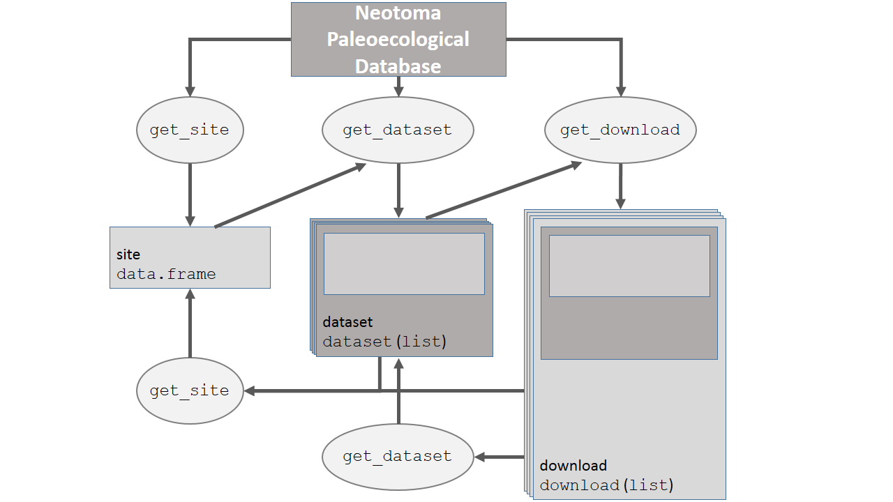

neotoma: A Programmatic Interface to the Neotoma Paleoecological Database
========================================================

<!--

```{r setup-knitr, echo = FALSE, message = FALSE}
# Simon: Note that these are global options that apply to all chunks below.
knitr::opts_chunk$set(
  comment = " ",
  error = FALSE,
  # Note: I have set EVAL to false just to make the bib work. 
  # Once the bib is fixed, you'll set this to TRUE or just delete this line.
  eval = TRUE,
  cache = TRUE,
  tidy = FALSE
  # Note to @gavinsimpson, I think this is now a knitr issue.
  # I'll file a bug PR with knitr
)


library("pander")
library("plyr")
panderOptions('table.style', 'rmarkdown')
```
-->

Simon Goring^1^
Andria Dawson^2^
Gavin L. Simpson^3^
Kathik Ram ^4^
Russ W. Graham^5^
Eric C. Grimm^6^
John W. Williams^1,7^

^1^ Department of Geography, University of Wisconsin-Madison, Madison, WI, USA

^2^ Department of Statistics, University of California, Berkeley, CA, USA

^3^ Institute of Environmental Change and Society, and Department of Biology, University of Regina, Regina, SK, Canada

^4^ Berkeley Institute for Data Science, University of California, Berkeley. Berkeley, CA

^5^ Department of Geosciences, Pennsylvania State University, University Park, PA, USA

^6^ Research and Collections Center, Illinois State Museum, Springfield, IL, USA

^7^ Center for Climatic Research, University of Wisconsin-Madison, Madison, WI, USA

Contact: goring@wisc.edu


Abstract:
-------------------

Paleoecological data are integral to ecological analyses. First, they provide an opportunity to study ecological and evolutionary interactions between communities and abiotic environments over long time scales. Second, they allow us to study processes that occur infrequently, such as megadroughts, hurricanes, and rapid climate change. Third, the past allows us to study ecological processes in the absence of widespread anthropogenic influence.

The R package `neotoma`, described here, obtains and manipulates data from the Neotoma Paleoecological Database (Neotoma Database: [http://www.neotomadb.org]()).  The Neotoma Database is a public-domain searchable repository for multiproxy paleoecological records spanning the past 5 million years. The Neotoma Database provides the cyberinfrastructure to study spatiotemporal dynamics of species and communities from the Pliocene to the present; `neotoma` provides a user interface to enable these studies. `neotoma` searches the Neotoma Database using  terms that can include location, taxon name, or dataset type (e.g., pollen, vertebrate fauna, ostracode) using the Database's Application Programming Interface (API). The package returns a set of nested metadata associated with the site, including the full assemblage record, geochronological data to enable the rebuilding of age models, dataset metadata (e.g. age range of samples, date of accession into Neotoma, principal investigator), and site metadata (e.g. location, site name and description). `neotoma` also provides tools to allow cross-site analysis, including the ability to standardize taxonomies using built-in taxonomies derived from the published literature or user-provided taxonomies.

To demonstrate the use of the `neotoma` package we provide examples of key functions based on the published literature, for both plant and mammal taxa.

Keywords: R software, neotoma, paleoecology, database, pollen, mammal

Introduction
--------------------

Paleoecological data are fundamental to understanding the patterns and drivers of biogeographical, climatic, and evolutionary change, ranging from the recent past to the dawn of life.  Although individual site-level studies have provided significant insights into past ecological dynamics, the true power of paleoecological data emerges from networks of data assembled to study broad-scale ecological and evolutionary phenomena, e.g. the responses of speciation rates to the five major extinction events in geological history [@peters2001biodiversity; @raup1984periodicity; @sepkoski1997biodiversity] and the rapid and individualistic responses of species to the climate changes accompanying recent glacial-interglacial cycles [@davis1981quaternary; @schroeder1996spatial; @huntley1988vegetation; @tzedakis1994vegetation; @williams2004late].  Paleoecoinformatics [@brewer2012paleo; @uhen2013card] is dedicated to providing tools to researchers across disciplines to access and use large paleoecological datasets spanning thousands of years.  These datasets may be used to provide better insight into regional vegetation change [@blois2013modeling; @blarquez2014disentangling], patterns of biomass burning [@marlon2013global], or changing rates of geophysical processes through time [@goring2012depo]. The increasing interest in uniting ecological and paleoecological data to in order to better understand responses to a rapidly changing world [@fritz2013diversity; @behrensmeyer2012building; @dietl2011conservation] will require more robust tools to access and synthesize  data from the modern and paleo time domains.

The Neotoma Paleoecological Database represents a consortium of paleoecological databases, with distributed scientific governance and expertise, but sharing a common database infrastructure. Constituent databases include, among others, the European,  Latin American, and  North American Pollen Databases; the North American Plant Macrofossil Database; FAUNMAP (Pliocene to Quaternary mammal fossils in the  United States and Canada); the North Dakota State University Fossil Insect Database; the North American Non-Marine Ostrocode Database; and the Diatom Paleolimnology Data Cooperative. Neotoma is the outgrowth of a longstanding collaboration between the European Pollen Database and the North American Pollen Database [@grimm2013databases] and the desire to integrate these data with faunal and other paleo data. The database framework was generalized from the pollen databases (which had identical structures) and the FAUNMAP database to accomodate both macro- and microfossil data as well as other kinds of data such as  geochemical, isotopic, and  loss-on-ignition. Work is underway to include other taxonomic groups and depositional contexts (e.g.  testate amoeba records, packrat midden data), thus further expanding the data that can be accomodated by Neotoma. Crucially, Neotoma is a vetted database.  Through the use of data stewards --- domain experts distributed among constituent bases who can check for inaccuracies, upload and manage data records --- Neotoma can support high qualitycontrol assurance for each of the constituent data types, and receive feedback from research communities involved with each specific data type [@grimm2013databases].

The Neotoma Database has also developed an Application Programming Interface (API) that allow users to query the database via web services, which return data using properly formed URL requests. For example, the URL: [http://api.neotomadb.org/v1/apps/geochronologies/?datasetid=8]() will return all geochronological data for the record associated with the dataset ID 8.

The analysis of paleoecological data is often performed using the statistical software R [@RCoreTeam2014]. There are several R packages designed specifically for paleoecological data analysis, including  `analogue` [@analogue2014; @analogue2007] and `rioja` [@rioja2013] for paleoenvironmental reconstruction, `Bchron` [@bchron2014] for radiocarbon dating and age-depth modeling and `paleofire` to access and analyse charcoal data [@blarquez2014paleofire]. Given the rapid proliferation and availability of these analytical tools in R, the rate-limiting step for analysis has become the difficulty of obtaining and importing data into R.  This bottleneck has meant reliance on static datasets that are available as published, and rarely updated, and on more *ad hoc* methods such as the distribution of individual datasets from author to analyst.

With an increasing push on the ecological community to perform and publish reproducible research that include numerically reproducible results [@goring2013pollen; @goring2012depo; @wolkovich2012advances; @reichman2011challenges] it is important to provide tools that allow analysts to directly access dynamic datasets, and to provide tools to support reproducible workflows. The rOpenSci project (<http://ropensci.org/>) is dedicated to developing tools that use R to facilitate a culture shift toward reproducible science in the ecology comunity.  As part of this effort, rOpenSci provides a number of tools that can directly interact with APIs to access data from a number of databases including `rfishbase` for FishBase [@boettiger2012rfishbase], and `taxize` for the Encyclopedia of Life, iPlant/Taxosaurus and others [@chamberlain2013taxize] among others.

The `neotoma` package addresses concerns regarding data access and workflow reproducibility by providing users with tools that allow paleoecologists to query, download, organize, and summarize data from the Neotoma database using R. Here we describe the `neotoma` package, then we present use cases for the package, using examples drawn from the ecological literature, with the general objective of illustrating how `neotoma` provides tools to perform paleoecological research in an open and reproducible manner.

The `neotoma` package
---------------------------
The `neotoma` R package is an interface between the Neotoma Paleoecological Database ([http://neotomadb.org]()) and statistical tools in R.  `neotoma` uses an API to send data requests to the Neotoma Database, and then forms data objects that are compatible for use with existing packages such as `analogue` [@analogue2014] and `rioja` [@rioja2013], which are used for environmental reconstruction, manipulation, and presentation of paleoecological data.  The `neotoma` package also includes tools to standardize pollen taxon names across sample sites using a set of published pollen taxonomies for North America, or user defined taxonomies.


**Figure 1**. *Major classes in `neotoma`, their relations to one another and the associated methods (functions).  The classes described below have a heavier outline than their associated variables.*

Data in the `neotoma` package is represented in three main classes (Figure 1): `"site"`s, `"dataset"`s (grouped into `"dataset_list"`s), and `"download"`s (grouped into `"download_list"`s). A `"site"` is the most basic form of spatial information representing the spatial locations of datasets along with site names, descriptions and a unique `site.id`. `"site"`s are `"data.frame"`s with columns `siteid`, `sitename`, `lat`, `long`, `elev`, `description`, `long_acc`, and `lat_acc`. These column headings are generally self explanatory; `long_acc` and `lat_acc` are used to indicate the width of the bounding box for a sample site (with a midpoint of `long` and `lat`).  In the Neotoma Database, examples of sites include a lake from which one or more cores are collected, a cave from which one or more faunal assemblages are collected,  an archaeological dig with one or more excavation pits, and so forth. Each unique site returned by the `get_site()` search is placed in a row, providing enough descriptive data to plot locations and understand the spatial context of a site.

Although `get_site()` is useful for first-pass surveys of data availability, analysts more commonly will want to search for and retrieve datasets stored in the Neotoma Database. The function `get_dataset()` uses search terms almost identical to those used in `get_site()`, and it returns a more complete description of the datasets available. However, at this time only `get_site()` has the ability to search for sites based on site names. 

`"dataset"`s associated with individual sites can be obtained using `get_dataset()`. Each search using `get_dataset()` returns a `"dataset_list"`, a list of one or more `"dataset"`s, equal to the number of datasets returned by the function.  `get_dataset()` returns the metadata associated with a dataset in the Neotoma Database.  Neotoma's datasets are the containers for a set of samples of the same type from a single collection unit within a site.  Examples of datasets in Neotoma include 1) all the pollen counts from a single core from a lake, 2) all the geochronological measurements (e..g radiocarbon dates)  from a sediment core, 3) all the faunal data  from an excavation in a cave, 4) all the plant macrofossil data from a packrat midden . In `neotoma`, a `"dataset"` includes the `"site"` for each `"dataset"` (as `"site.data"`, Figure 1), along with the `"dataset"` specific metadata (`"dataset.meta"` in Figure 1).  The `dataset` also includes the principal investigator, submission date to Neotoma, and the date that the information was accessed via the Neotoma API using the R package. `"dataset_list"`s and `"dataset"`s can be used to access the full `"download"` using the `get_download()` method.

`get_download()` returns an object of class `"download_list"` containing one or more objects of class `"download"` (Figure 1).  `get_download()` will also return a confirmation message for each individual API call as the function proceeds that can be turned off using the argument `verbose = FALSE`.  Each `"download"` contains the associated `"dataset"` (Figure 1).  The `"sample.meta"` component is where the core depth and age information is stored. The actual chronologies are stored in `"chronologies"`.  If a core has a single age model then `"chronologies"` has a length of one. Some cores have multiple chronologies and these are also included in the `"chronologies"` list. The default chronology is stored in `"sample.meta"` and is always the first chronology in `"chronologies"`.

To build a new chronology with the same chronological controls as an existing chronology, perhaps using a different algorithim, `get_chroncontrol()` can be used to return the chronological controls and the `"chronology.id"` in either `"sample.meta"` or any one of the `"chronologies"` objects. While the chronological controls used to build a chronology may vary across chronologies for a single site, the default model contains the "best" chronological control data, as determined at the time the chronologies for the collection unit were last reviewed. It is important to note, however, that the "best" chronologies for most collection units in the database were based on "classical" age models [@blaauw2010methods] that do not include estimates of uncertainty. Moreover, these default age models that are in calibrated radiocarbon years utilize radiocarbon dates that are calibrated a priori. Bayesian age modeling programs, such as `Bacon` [@blaauw2011flexible], which provides estimates of uncertainty, as well as the classical age modeling program `clam` [@blaauw2010methods], which also returns estimates of uncertainty, utilize uncalibrated radiocarbon dates as input. Thus, the calibrated ages of many existing age models in Neotoma will not be appropriate for these programs, and the age controls may have to be obtained from the geochronology table using `get_geochron()`. 

The age controls of existing default radiocarbon-year chronologies may sometimes be appropriate for programs such as `Bacon` and `clam`; however, many of these chronologies rejected radiocarbon dates *a priori*, which could be included when using `Bacon`.  The `neotoma` package has a function to interface directly with `Bacon` or `clam`, called `write_agefile()`, which will output a correctly formatted age file for either of these applications using a `"download"` object.

The `"taxon.list"` component lists taxa found in the dataset samples (`"counts"`) and any laboratory data (`"lab.data"`), along with the units of measurement and taxonomic grouping (Figure 1).  The `"counts"` are the actual count, presence or percentage data recorded for the dataset.  The `"lab.data"` component contains information about any spike used to determine concentrations, sample quantities and, in some cases, charcoal counts.


**Figure 2**. *How the main data objects relate to one another in the `neotoma` package, and the helper functions used to move from one data type to another.*

Each of these objects, `"site"`, `"dataset"` and `"download"` can be obtained using direct calls to the API, or using functions defined in the `neotoma` package (Figure 2).

Examples
------------------
Here we present several examples that both introduce users to the `neotoma` package, and highlight how `neotoma` can be used in a paleoecological workflow. We begin with a simple example in which we compare change in *Alnus* pollen between two sites during the late Quaternary, followed by two more involved examples where we look at *Pinus* migration and changes in late-Quaterary mammal distributions in the United States.

### A simple example
A researcher is interested in finding the pollen record for Marion Lake, in British Columbia [@mathewes1973palynological], and comparing changes in *Alnus* pollen to the Louise Pond  record [@pellatt1997holocene] from Haida G'Waii, further north.  We search for specific sites by name using `get_site()`, making use of the wildcard `"%"` to catch sites whose site names begin with the strings `"Marion Lake"` or `"Louise Pond"`:

```{r load-pkgs-1-code, echo = FALSE, warning = FALSE, message = FALSE}
library("neotoma")
suppressPackageStartupMessages(library("analogue"))
```


```{r load-pkgs-1}
library("neotoma")
marion <- get_site(sitename = 'Marion Lake%')
louise <- get_site(sitename = 'Louise Pond%')
louise
```

In each case `get_site()` returns a single `"site"` (Figures 1 & 2).  Here we queried the Neotoma database for site based on `sitename`, but alternately we could have queried for sites within a geographical bounding box, or by geopolitical region.

To get `"dataset"`s for these records we can bind the two records together by rows using `rbind()`, and pass the result directly to `get_dataset()` (Figure 2):

```{r get-dataset-simple}
western.sites <- rbind(marion, louise)
western.data  <- get_dataset(western.sites)
```

`western.data` is a `"dataset_list"`, containing two `"dataset"`s (Figure 1).  The `"dataset"` for a site will be nested within a `"dataset_list"`, even if only a single site is returned, so that methods can be consistent across classes and functions.  This means that a single `"dataset"` must be retrieved as *e.g.*, `western.data[[1]]` (this is also the case for `"download"` and `"download_list"` objects).  The use of `"dataset"` and `"dataset_list"` classes allow us to easily move between `get_dataset()`, `get_site()` and `get_download()`. We can see the special `print()` method for both `"dataset"`s and `"dataset_list"`s:

```{r print-dataset-simple}
western.data
western.data[[1]]
```

before we download the full records and print them:

```{r download-western.data}
western.dl <- get_download(western.data)
western.dl
western.dl[[1]]
```

Pollen taxonomy can vary substantially across cores depending on the level taxonomic resolution used by a pollen analyst, or as a result of changes to taxonomies over time.  One analyst might discriminate subgenera of *Pinus*, another might simply identify *Pinus* to the genus level.  Gramineae - a common pollen type in earlier pollen records - has now been renamed Poaceae. This variable and shifting taxonomy is a first-order challenge for analysts seeking to analyze the dynamics of taxa across multiple groups. `neotoma` provides several options for standardized taxonomic list, corresponding to three published taxonomies for the United States and Canada [@gavin2003statistical; @whitmore2005modern; @williams2008obtaining]. This function can be helpful, but should be used with care. The aggregation table is accessible using the command `data(pollen.equiv)` and the function to compile the data is called `compile_taxa()`. It can accomodate either the internal translation table provided with the package, or a user-defined table with the same structure as `pollen.equiv`.

We are interested in comparing the relative pollen abundances of *Alnus* between two sites. We compile the pollen data using the `'P25'` taxonomy from Gavin et al. [-@gavin2003statistical]. The first record downloaded is Marion Lake. We can see the `"download"` for Marion Lake the `taxon.table` has 5 columns:

```{r kable-western-codeonly, results='asis', eval = FALSE}
head(western.dl[[1]]$taxon.list)
```

```{r kable-western, results = 'asis', echo = FALSE}
df <- unrowname(western.dl[[1]]$taxon.list)
pandoc.table(head(df), justify = "left")
```

Once we apply `compile_taxa()` to the dataset using the `'P25'` compiler:

```{r compile-taxa-western, echo = TRUE, message = FALSE, warning = FALSE}
western.comp <- compile_taxa(western.dl, list.name = 'P25')
names(western.comp) <- c("marion", "louise")
```

The `taxon.table` for Marion Lake now has an extra column (note that several columns were removed to improve readability).

```{r kable-wstern-2-codeonly, results = 'asis', echo = TRUE, eval = FALSE}
head(western.comp[[1]]$taxon.list[,c(1, 5, 6)])
```
```{r kable-wstern-2, results = 'asis', echo = FALSE}
# The previous block shows just the code necesssary but skips the formatting parts needed to make the table play nice with pandoc
pandoc.table(head(western.comp[[1]]$taxon.list[,c(1, 5, 6)]), justify = "left")
```

`compile_taxa()` returns a `"download_list"` or `"download"`, for which `taxon.list` gains a column named `compressed` to link the original taxonomy to the revised taxonomy.  This linkage is an important reference for researchers who choose to use this package for large-scale analysis, but who might need to later check the aggregated taxonomic groups against the original data. In this example we see that all the spore types have been lumped into a single taxon *Other*.

The sample data (`"counts"`) contained in each `"download"` in the `"download_list"` `western.dl` are converted into percentages using `tran()` from the `analogue` package [@analogue2007]. We can then compare *Alnus* pollen percentages from these two locations to learn about vegetation changes on the west coast of North America during the Holocene:

```{r fig-3alnus-data-plot, dpi=300, dev=c('png','postscript','tiff')}
library("analogue")

marion.alnus <- tran(x = western.comp$marion$counts, method = 'percent')[,'Alnus']
louise.alnus <- tran(x = western.comp$louise$counts, method = 'percent')[,'Alnus']

alnus.df <- data.frame(alnus = c(marion.alnus, louise.alnus),
                       ages  = c(western.comp$marion$sample.meta$age,
                                 western.comp$louise$sample.meta$age),
                       site = c(rep('Marion', length(marion.alnus)),
                                rep('Louise', length(louise.alnus))))

plot(alnus ~ ages, data = alnus.df, col = alnus.df$site, pch = 19,
     xlab = 'Years Before Present', ylab = 'Percent Alnus')
```
**Figure 3**.  *Plots of* Alnus *pollen percentages at two sites, one in the lower mainland of British Columbia (Marion Lake, red) and the other on Haida G'waii (Louise Pond, black).  Axis labels are presented as if the code was run directly, but represent calibrated radiocarbon years before present on the x-axis and* Alnus *pollen percentages on the y-axis.*

Marion Lake (red, Figure 3) maintains much higher proportions of *Alnus* throughout its history, and has a rapid increase in *Alnus* pollen during the historical period.  This rapid shift in the last 200 years is likely as a result of rapid colonization by pioneer *Alnus rubra* following forest clearance and fire in the lower mainland of British Columbia [@mathewes1973palynological].

It is also possible to plot the pollen stratigraphy (Figure 4) at any one site using the `analogue` package for R [@analogue2007].  Here we plot Marion Lake:

```{r, fig-4marion-plot, fig.height=6, fig.width=6, echo=TRUE, message=FALSE, warning=FALSE, dpi=300, dev=c('png','postscript','tiff')}
core.pct <- data.frame(tran(western.comp[[1]]$counts, method = "percent"))
core.pct$age <- western.comp[[1]]$sample.meta$age
#  Eliminate taxa with no samples greater than 4%.
core.pct <- chooseTaxa(core.pct, max.abun = 4)
Stratiplot(age ~ ., core.pct, sort = 'wa', type = 'poly',
           ylab = "Years Before Present")
```
**Figure 4**. *Stratigraphic plot for Marion Lake.  Age is plotted on the y-axis in calibrated radiocarbon years before present.  The `analogue` package provides the opportunity for users to further customize the stratigraphic plot if so desired.*

### *Pinus* migration following the last Glacial Maximum
Macdonald and Cwynar [-@macdonald1991post]  used *Pinus* pollen percentages to map the northward migration of lodgepole pine (*Pinus contorta* var *latifolia*) following the retreat of the Laurentide Ice Sheet and the accompanying rise of temperatures in the late-Glacial and early Holocene. In their study a cutoff of 15% *Pinus* pollen was defined as the indicator of *Pinus* presence. Strong and Hills [-@strong2013holocene] have remapped the migration front using a lower pollen proportion (5%) and more sites.  Here, the analysis is partially replicated. Note that additional R packages must be installed and loaded for the following examples.

A spatial bounding box delimiting sites is defined for the search. Strong and Hills [-@strong2013holocene] use a region approximately bounded by 54^o^N and 65^o^N, and from 110^o^W to 130^o^W. The function `get_site()` can return all sites within a slightly expanded bounding box:

```{r load-pkgs-example-2, echo = TRUE, message=FALSE, warning = FALSE}
#install.packages('ggmap', 'ggplot2', 'reshape2', 'Bchron', 'gridExtra')
library("ggmap")
library("ggplot2")
library("reshape2")
library("Bchron")
library("gridExtra")

all.sites <- get_site(loc = c(-140, 45, -110, 65))
```

The code above returned `r nrow(all.sites)` sites. To narrow down the search we will use `get_dataset()` to search for all *Pinus* taxa within the same bounding box as above. `get_dataset()` can also limit the type of dataset, either by looking for specific taxa, or by describing the dataset type (e.g., `datasettype = 'pollen'` or `datasettype = 'mammal'`). The `%` wildcard indicates that any characters may follow a string starting with `"Pinus"`:

```{r all-datasets-pinus, echo = TRUE, message = FALSE, warning = FALSE}
all.datasets <- get_dataset(loc = c(-140, 45, -110, 65),
                            datasettype = 'pollen',
                            taxonname = 'Pinus%')
```

The API returned `r length(all.datasets)` datasets.  Many dropped sites were  pollen surface samples, or sites with datasets for other taxonomic groups. The distribution of the `r length(all.datasets)` fossil pollen sites can be plotted over the original `r nrow(all.sites)` sites. We use the `ggplot2` package [@wickham2009ggplot2] to make the figures:

```{r fig-5-map-pinus-example, echo = TRUE, message = FALSE, warning = FALSE, dpi=300, dev=c('png','postscript','tiff')}
map <- map_data('world')
ggplot(data = data.frame(map), aes(long, lat)) + 
  geom_polygon(aes(group=group), color = 'steelblue', alpha = 0.2) +
  geom_point(data = all.sites, aes(x = long, y = lat)) +
  geom_point(data = get_site(all.datasets),
  aes(x = long, y = lat), color = 2) +
  xlab('Longitude West') + 
  ylab('Latitude North') +
  coord_map(projection = 'albers', lat0 = 40, lat1 = 65, 
            xlim = c(-140, -110), ylim = c(45, 70))
```
**Figure 5** *Mapped sites with pollen cores in British Columbia, Alberta and the Yukon Territory of Canada (red), including other Neotoma sites without stratigraphic pollen data (black).*

The map (Figure 5) shows a number of sites in the interior of British Columbia that have no fossil pollen. There are also other sites not shown here that may have relevant data but have yet to be entered into the database. This highlights a common challenge in paleoecoinformatics --- the import of individual records into data repositories takes some time and is an on-going process that is aided by the collective contributions of the original analysts, data stewards, and large-scale research initiatives (e.g. PAGES 2K, PalEON). Fortunately, new software tools are speeding up the process of uploading and vetting data. The Tilia software ([http://www.neotomadb.org/data/category/tilia]()) has been updated to allow direct upload to the Neotoma Database and includes a large number of automated data quality checks and standardized look-up tables for variable names. Because `neotoma` directly  links to the Neotoma Database via APIs, analyses using `neotoma` can be updated continuously as new sites are added.

To obtain the data for the `r length(all.datasets)` sites we use `get_download()`:

```{r get-downloads-pinus, echo = TRUE, message = FALSE, warning = FALSE}
all.downloads <- get_download(all.datasets, verbose = FALSE)
```

Only the percentage of *Pinus* is of interest, so we can again compile the taxa across the `"download_list"` using the 'P25' taxonomy [@gavin2003statistical]:

```{r pinus-compile, message = FALSE, warning = FALSE}
compiled.cores <- compile_taxa(all.downloads, 'P25')
```

We want to determine which sample has the first local *Pinus* presence in each core using a cutoff of 5% [@strong2013holocene].  We can find which rows in the *Pinus* column in each `"download"`'s `"count"` data frame have presence over 5% and then find the highest row number since the samples in a dataset are ordered stratigraphically, with the youngest sample in the top row and the oldest sample in the bottom row.  This is a more complicated example:

```{r pinus-first-occur, echo = TRUE, warning = FALSE}
top.pinus <- function(x) {
  x.pct <- tran(x$counts, method = "proportion")
  #  Cores must span at least the last 5000 years (and have no missing dates):
  old.enough <- max(x$sample.meta$age) > 5000 & !all(is.na(x$sample.meta$age))
  #  Find the highest row index associated with Pinus presence over 5%
  oldest.row <- ifelse(any(x.pct[, 'Pinus'] > .05 & old.enough),
                       max(which(x.pct[, 'Pinus'] > .05)),
                       0)
  #  return a data.frame with site name & location, and the age and date type
  #  (since some records have ages in radiocarbon years) for the oldest Pinus.
  out <- if (oldest.row > 0) {
      data.frame(site = x$dataset$site.data$site.name,
                 lat = x$dataset$site.data$lat,
                 long = x$dataset$site.data$long,
                 age = x$sample.meta$age[oldest.row],
                 date = x$sample.meta$age.type[oldest.row])
  } else {
      NULL
  }
  out
}

#  Apply the function 'top.pinus' to each core using lapply and rbind:
summary.pinus <- do.call("rbind.data.frame", lapply(compiled.cores, top.pinus))
```

We need to calibrate dates that are recorded in radiocarbon years using the `Bchron` package [@bchron2014].  In most cases the original uncertainty for individual ages is not recorded in `"sample.meta"` so we assume a 100 year standard deviation.  Note that direct recalibration of radiocarbon dates from interpolated age models is not the best approach, but is sufficient for our purposes here:

```{r fig-6-pinus-recal-plot, echo = TRUE, fig.width = 7, fig.height = 4, warning = FALSE, dpi=300, dev=c('png','postscript','tiff')}
radio.years <- summary.pinus$date %in% 'Radiocarbon years BP'
sryears <- sum(radio.years, na.rm = TRUE)
# BChronCalibrate is in the BChron package:
calibrated <- BchronCalibrate(summary.pinus$age[radio.years],
                              ageSds = rep(100, sryears),
                              calCurves = rep('intcal13', sryears))

#  we want the weighted means from 'calibrated'
wmean.date <- function(x) sum(x$ageGrid*x$densities / sum(x$densities))

summary.pinus$age[radio.years] <- sapply(calibrated, wmean.date)
summary.pinus <- na.omit(summary.pinus)
summary.pinus <- subset(summary.pinus, subset=!(age < 2000 & long < -130))

#  A loess curve is straightforward, but not the best model:
regress <- ggplot(summary.pinus, aes(x = lat, y = age)) +
                  geom_point(aes(color = age), size = 2) +
                  scale_y_reverse(expand = c(0, 100)) +
                  xlab('Latitude North') + 
                  ylab('Years Before Present') +
                  geom_smooth(n = 40, method = 'loess') +
                  geom_rect(aes(xmin = 59, xmax = 60, ymin = 7000, ymax = 10000), 
                  color = 2, fill = 'blue', alpha = 0.01)

mapped <- ggplot(data = data.frame(map), aes(long, lat)) + 
                 geom_polygon(aes(group = group), color = 'steelblue', alpha = 0.2) +
                 geom_point(data = summary.pinus, 
                 aes(x = long, y = lat, colour = age), size = 3) +
                 coord_map(projection = 'albers', lat0 = 40, lat1 = 65, 
                 xlim = c(-140, -110), ylim = c(40, 70)) +
                 theme(legend.position = 'none')

grid.arrange(mapped, regress, nrow=1)
```
**Figure 6**. *Mapped ages of first* Pinus *establishment in the interior of British Columbia and the Yukon Territory based on a 5% pollen cut-off.  The age of first appearance is also plotted and smoothed with a loess curve.*

The results show a clear pattern of northward expansion for *Pinus* in northwestern North America (Figure 6). These results broadly agree with the findings of Strong and Hills  [-@strong2013holocene] who suggest that *Pinus* reached a northern extent between 59^o^N and 60^o^N at approximately 10--7 ka cal BP as a result of geographic barriers before continuing northward after 7 ka cal BP.

### Mammal Distributions in the Pleistocene

Graham et al. [-@graham1996spatial] built and applied the FAUNMAP dataset ([http://www.ucmp.berkeley.edu/faunmap/]()) of fossil assemblages to elucidate patterns of change in mammal distributions through the Pleistocene to the present. The paper uses various multivariate analyses to show, in part, that mammal species have responded in a Gleasonian manner to climate change since the late-Pleistocene. Graham et al. [-@graham1996spatial] show some species migrating northward in response to warming climates, others staying relatively stable, and some moving southward.  FAUNMAP has been incorporated into Neotoma (and expanded with new records), and this example performs some simple analyses that show how different species responded to the changing climate of the last deglaciation.

First, all vertebrate fauna  datasets are obtained from Neotoma:

```{r mammal-example, message = FALSE, warning = FALSE, echo = TRUE}
#  Bounding box is effectively the continental USA, excluding Alaska
mam.set <- get_dataset(datasettype= 'vertebrate fauna',
                       loc = c(-125, 24, -66, 49.5))
#  Retrieving this many sites can be very time consuming
mam.dl <- get_download(mam.set)
```

Sites are assigned to time-period bins as in Graham et al. [-@graham1996spatial]; Modern (< 0.5 ka cal BP), Late Holocene (0.5-- 4  ka cal BP), Early-Mid Holocene (4--10 ka cal BP), Late Glacial (10--15 ka cal BP), Full Glacial (15--20 ka cal BP) and Late Pleistocene (> 20 ka cal BP). The first step is to build a large table with `time` and `xy` coordinates for each site. Time data in `"sample.meta"` for the mammal data is not the same as for for pollen where age is commonly found in the `sample.meta$age` component. Most vertebrate fauna samples are assigned only younger (`sample.meta$age.younger`) and older (`sample.meta$age.older`, Figure 1) bounds with no estimates of mean or median age. In this example we average the younger and older ages to determine sample age. We recognize that this averaging of ages is likely to be methodologically indefensible in the scientific literature, but is sufficient for illustrative purposes here.Here we make use of the `reshape2` package [@reshape2007] to help manipulate data structures.

```{r mammal-example-compile, echo = TRUE, message = FALSE, warning = FALSE}
compiled.mam <- compile_downloads(mam.dl)
time.bins <- c(500, 4000, 10000, 15000, 20000)
mean.age <- rowMeans(compiled.mam[,c('age.old', 'age.young', 'age')],
                     na.rm = TRUE)
interval <- findInterval(mean.age, time.bins)
periods <- c('Modern', 
             'Late Holocene', 
             'Early-Mid Holocene', 
             'Late Glacial', 
             'Full Glacial', 
             'Late Pleistocene')
compiled.mam$ageInterval <- periods[interval + 1]
mam.melt <- melt(compiled.mam,
                 measure.vars = 10:(ncol(compiled.mam)-1),
                 na.rm = TRUE,
                 factorsAsStrings = TRUE)
mam.melt <- transform(mam.melt, ageInterval = factor(ageInterval, levels = periods))
mam.lat <- dcast(data = mam.melt, variable ~ ageInterval, value.var = 'lat',
                 fun.aggregate = mean, drop = TRUE)[,c(1, 3, 5, 6)]
#  We only want taxa that appear at all time periods:
mam.lat <- mam.lat[rowSums(is.na(mam.lat)) == 0, ]
#  Group the samples based on the range & direction (N vs S) of migration.
#  A shift of only 1 degree is considered stationary.
mam.lat$grouping <- factor(findInterval(mam.lat[,2] - mam.lat[, 4],
                                        c(-11, -1, 1, 20)),
                           labels = c('Southward', 'Stationary', 'Northward'))
mam.lat.melt <- melt(mam.lat)
colnames(mam.lat.melt)[2:3] <- c('cluster', 'Era')
```

The output of the above manipulations is displayed via a `ggplot2` plot using

```{r fig-7-mammal-example-plot, fig.width = 7, fig.height = 4, echo = TRUE, warning = FALSE, dpi=300, dev = c('png','postscript','tiff')}
ggplot(mam.lat.melt, aes(x = Era, y = value)) + 
  geom_path(aes(group = variable, color = cluster)) + 
  facet_wrap(~ cluster) +
  scale_x_discrete(expand = c(.1,0)) +
  ylab('Mean Latitude of Occurrance') +
  theme(axis.text.x = element_text(angle = 90, hjust = 1))
```
**Figure 7**. *Mean latitudinal distribution of fossil mammal taxa during the late-Pleistocene show that while there appears to be a net northward migratory pattern, a number of taxa appear not to shift their ranges, or move southward following deglaciation.*

Even with this fairly simple set of analyses we see that species did not respond uniformly to climatic warming following deglaciation (Figure 7), consistent with the prior work of Graham *et al*. [-@graham1996spatial]. Although most range shifts were northward, a number of taxa show little change in their ranges and a number show southward range shifts (Figure 7). This example does not examine east-west movement and ignores the issues that may be associated with the complex topography of the mountainous west, or possible confounding effects introduced by temporal variations in the available set of sites. The broader point here is that the use of `neotoma` can support research that is synchronized with the data holdings of large repositories such as Neotoma and reproducible.

Conclusion
==========================
The whole of the fossil record is much greater than the sum of its parts. Many of our discipline's most important advances were made possible only by the synthesis of many individual fossil occurrences into regional- to global-scale databases of species occurrences, *e.g.*, the Neotoma Paleoecology Database and the Paleobiological Database.  Current frontiers in paleoecological informatics include 1) facilitating the input of data into these databases, 2) improved sophistication of the data models employed by these databases, enabling them to handle increasingly complex arrays of paleobiological and associated geochronological data, and 3) enabling the frictionless integration of these resources with other cyberinfrastructure [@uhen2013card; @brewer2012paleo; @C4PExecutive2013].

Here we present the `neotoma` package for R and show how it can be used to directly transfer data from the Neotoma Paleoecology Database into the R statistical computing environment.  The broader goals of this effort are 1) to ease the transfer of data from Neotoma into an environment widely used for paleoecological analyses [@analogue2014; @analogue2007; @rioja2013] and 2) to enable transparent and reproducible scientific workflows.  The `neotoma` package itself is available either from the CRAN repository, or from GitHub ([http://github.com/ropensci/neotoma]()) where ongoing open-source development continues. Suggestions for improvement and new code contributions by readers and users are welcome.

Acknowledgements
==========================================
We would like to acknowledge the support of the ROpenSci project and the invaluable efforts made by data contributors across the globe who have provided the platform upon which Neotoma and the `neotoma` package are built. This paper is a product of the PalEON project ([http://paleonproject.net]()), funded through the NSF-Macrosystems program grants #1065656, 1241868 and 1241874, and the Neotoma Paleoecology Database, funded by the NSF Geoinformatics program grants #0947459 and #0948652. GLS was supported by the Natural Sciences and Engineering Research Council of Canada (NSERC) Discovery Grant Program (RGPIN 2014-04032).

References
==========================================
