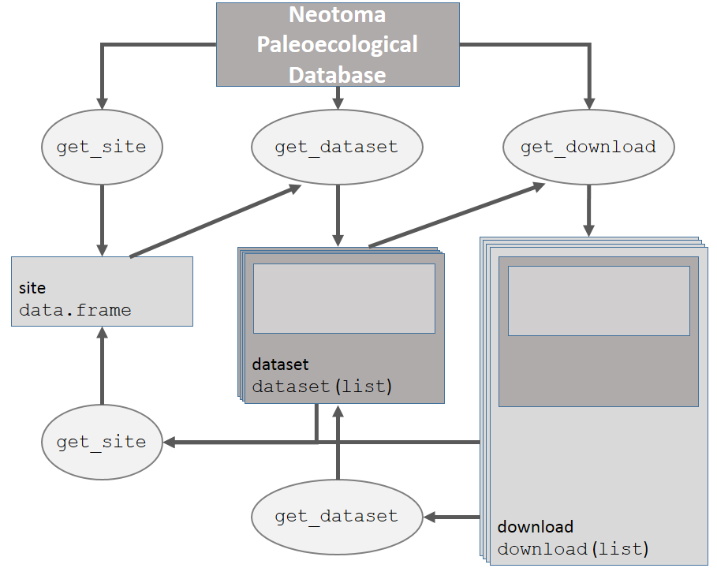

neotoma: A Programmatic Interface to the Neotoma Paleoecological Database
========================================================

```{r, echo = FALSE, message = FALSE}
# Simon: Note that these are global options that apply to all chunks below.
knitr::opts_chunk$set(
  comment = " ",
  error = FALSE,
  # Note: I have set EVAL to false just to make the bib work. 
  # Once the bib is fixed, you'll set this to TRUE or just delete this line.
  eval = TRUE,
  tidy = TRUE
)
```

Abstract:
-------------------

Paleoecological data is an integral part of ecological analysis.  It provides an opportunity to study interactions between ecological communities and abiotic environments at time scales that cannot be observed through modern field studies.  Paleoecological analysis allows us to observe changes in ecological processes that operate at centennial and millennial scales, or processes that occur infrequently, such as megadroughts, hurricanes, rapid climatic change and volcanic eruptions.  Paleoecological inference also can allow us to understand ecological processes in the absence of widespread antrhopogenic influence.

Here we describe the R package `neotoma`, to be used to obtain and manipulate paleoecological data from the Neotoma Paleoecological Database (Neotoma: \url{http://www.neotomadb.org}).  Neotoma is a searchable repository for multi-taxon and multiproxy records of the past 5 million years that includes spatiotemporal data, providing the opportunity to explore biogeographic patterns from the Pliocene ato the present.  `neotoma` searches the Neotoma Database for datasets using search keys that can include location, taxon or dataset types (*e.g.*, pollen, mammal, ostrocode) using the database's Application Programming Interface (API).  The package returns a set of nested metadata associated with the site, including the full assemblage record, dataset specific information (age range of samples, date of accession into Neotoma, site principle investigator) and site specific information (location, site name and description).  `neotoma` also provides a set of tools to allow cross-site analysis, including the ability to standardize taxonomies using one of several recognized standard taxonomies from the published literature, although at present this ability is limited to pollen data only.

To assist with the use of the `neotoma` package we provide examples of key functions using examples from the published literature, for both plant and mammal taxa.

Introduction
--------------------
Paleoecological data are used to understand patterns and drivers of biogeographical, climatic and evolutionary change at multiple spatial and temporal scales.  Paleoecoinformatics [@brewer2012paleo; @uhen2013card] is increasingly providing tools to researchers across disciplines to access and use large datasets spanning thousands of years.  These datasets may be used to provide better insight into patterns of biomass burning (Blarquez et al, 2013; Power et al.), regional vegetation change [@blois2013modeling; @blarquez2014disentangling] or changing sedimentation rates through time [@goring2012depo]. The increasing interest in uniting ecological and paleoecological data to understand modern ecological patterns and responses to climate change [@fritz2013diversity; @behrensmeyer2012building; @dietl2011conservation] means that efforts to unite these two, seemingly independedent data-streams will rely, in part, on more robust tools to access and synthesize paleoecological data.

The Neotoma Paleoecological Database is the result of longstanding collaboration between the European Pollen Database and the North American Pollen Database [@grimm2013databases].  The database framework was generalized from pollen data to accomodate other macro- and microfossil data and other geochemistry information including loss-on-ignition and isotope records.  Constituent databases include the European, Indo-Pacific, Latin American, North American Pollen Database, FAUNMAP (Pliocene to Quaternary mammal fossils in the continental United States), the North American Non-Marine Ostrocode Database, and the Diatom Paleolimnology Data Cooperative.  Work is underway to include the North American Fossil Beetle Database, testate amoeba records, the North American Plant Macrofossil Database and the Digital Archaeological Record, thus further expanding the data that can be accomodated by Neotoma.  Through the use of data stewards - domain-specific experts who can check for inaccuracies, upload and manage data records - Neotoma can support high quality assurance for each of the constituent data types, and receive feedback from research communities involved with each specific data type [@grimm2013databases].

From the paleoecological database Neotoma has also developed Application Programming Interfaces, that allow users to query the database through the internet using properly formed URLs.  For example, the URL: http://api.neotomadb.org/v1/apps/geochronologies/?datasetid=8 will return all geochronological data for a single record associated with the datasetid provided.  

The statistical software R [@RCoreTeam2014] is commonly used for analysis of paleoecological data and several packages in R exist for analysis including `analogue` [@analogue2013; @analogue2007] and `rioja` [@rioja2013] for paleoenvironmental reconstruction, `Bchron` for radiocarbon dating and age-depth modeling [@bchron2014] and `paleofire` to access and analyse charcoal data [@paleofire2014]. Notwithstanding these packages, the use of extensive paleoecological resources within R has traditionally relied on *ad hoc* methods of obtaining and importing data.  This has meant reliance on datasets such as those from the NOAA Paleoclimate Repository or the North American Modern Pollen Database, and on the distribution of individual datasets from author to analyst.

With an increasing push to provide paleoecological publications that include numerically reproducible results (e.g., @goring2012depo; @gill2013linking; @goring2013pollen) it is important to provide tools that allow analysts to directly access dynamic datasets, and to provide tools to support reproducible workflows.  The rOpenSci project has provided a number of tools that can directly interact with application programmatic interfaces (APIs) to access data from a number of databases including rfishbase (FishBase: [@boettiger2012rfishbase] and taxize (Encyclopedia of Life, iPlant/Taxosaurus and others: [@chamberlain2013taxize] among others.

To illustrate use cases for the `neotoma` package we present examples drawn from the paleoecological literature to illustrate how `neotoma` provides the tools to perform research that is critical to understanding paleoecological change in the Pleistocene in an open and reproducible manner.

The `neotoma` package
---------------------------
Here we describe `neotoma`, an R package that acts as an interface between a large dynamic database (the Neotoma Paleoecological Database: [http://neotomadb.org]()) and statistical tools in R.  `neotoma` uses an API to send data requests to Neotoma, and then forms data objects that can interact with existing packages such as `analogue` [@analogue2013] and `rioja` [@rioja2013], that are used for environmental reconstruction, manipulation and presentation of paleoecological data.  The `neotoma` package also includes tools to standardize pollen data across sample sites using a set of commonly accepted pollen taxa.

Data in the neotoma package is represented in three main classes. (1) a `site` is the most basic form of spatial information, it is a representation of all data points, as a special class of `data.frame`.  A `site` contains site names, locations and, when supplied, site descriptions, along with a unique `siteID`.  Individual sites can be associated with one or more `dataset`s.  A `dataset` is a special type of `list` that includes a `site` class for each dataset, but also includes information about the particular dataset, including the data type, the principle investigator, the submission date to Neotoma and the date that the information was accessed from Neotoma using the R package.  The `dataset` also includes a unique `dataset.id` that can be used to access the full `download`.  A `download` contains both `site` and `dataset` information, but it also contains the full data object for the dataset it references, whether it is pollen, ostrocode, mammal or other data.


**Figure 1**. *How the main data objects relate to one another in the `neotoma` package, and the helper functions used to move from one data type to another.*

Each of these objects, `site`, `dataset` and `download` can be obtained using direct calls to the API, or 

Examples
------------------
Macdonald and Cwynar [-@macdonald1991post] used pollen percentage data for *Pinus* to map the northward migration of lodgepole pine (*Pinus contorta* var *latifolia*) following glaciation.  In their study a cutoff of 15% *Pinus* pollen is associated with presence at pollen sample sites.  Recent work by Strong and Hills [@strong2013holocene] has remapped the migration front using a lower pollen proportion (5%) and more sites.  Here, we attempt to replicate the analysis as an example both of the strengths of the package and limitations of paleoinformatic approaches.

To begin we must define a spatial bounding box and a set of taxa of interest.  Strong and Hills [-@strong2013holocene] use a region approximately bounded by 54^oN to the south and 65^oN to the North, and from 110^o^W to 130^o^W.  The function `get_site` is used to find all sites within a bounding box:

```{r, echo = FALSE, message = FALSE, warning=FALSE}
# These are just some options I like to set - KR
knitr::opts_chunk$set(
  comment = "#>",
  error = FALSE,
  tidy = TRUE,
  message = FALSE
)
```

```{r, echo=TRUE, message=FALSE, warning=FALSE}
library("neotoma")
library("analogue")
library("ggmap")
library("ggplot2")
library("reshape2")
library("plyr")
library("Bchron")
library("gridExtra")
library("knitr")

all.sites <- get_site(loc = c(-140, 45, -110, 65))
```

The `get_sites` function returns a site data frame, with the columns `siteID`, `latitude`, `longitude`, `altitude`, `SiteName`, and `SiteDescription`.  Each row represents a unique site.

We can see that this returns a total of `r nrow(all.sites)` sites.  Sites are effectively containers for datasets though.  Generally it's better to search for datasets.  When you search for a dataset you can limit the type of dataset, either by looking for specific taxa, or by describing the dataset type.  Here we will look for all taxa beginning with *Pinus* in a pollen dataset.  We use the `*` wildcard to indicate any and all taxa with *Pinus* in their name:

```{r, echo=TRUE, message=FALSE, warning=FALSE}
all.datasets <- get_dataset(loc = c(-140, 45, -110, 65),
                             datasettype='pollen',
                             taxonname='Pinus*')

```

A dataset is a larger data object.  The dataset has site information, but it also has information about the specific dataset.

Here the API tells us we now have only `r length(all.datasets)` records of the original `r nrow(all.sites)`.  Many of the samples are pollen surface samples, or vertebrate fauna, meaning pollen core data comprises less than half of the records.  Regardless, we now know that there is pollen core data from `r length(all.datasets)` sites and we can plot those sites over our original `r nrow(all.sites)`.

```{r, echo=TRUE, message=FALSE, warning=FALSE}

map <- map_data('world')

ggplot(data = data.frame(map), aes(long, lat)) + 
  geom_polygon(aes(group=group), color='blue', alpha=0.2) +
  geom_point(data = all.sites, aes(x = long, y = lat)) +
  geom_point(data = get_site(dataset = all.datasets),
             aes(x = long, y = lat),
             color = 2) +
  xlab('Longitude West') + ylab('Latitude North') +
  coord_map(projection='albers', lat0=40, lat1=65, 
            xlim=c(-140, -110), ylim=c(40, 70))

```

So we see that there are a number of sites in the interior of British Columbia that have no core pollen.  For many of these cores pollen records exist.  This is an obvious limitation of the use of large datasets.  While many dataset have been entered into Neotoma, a large number have yet to make their way into the repository.  An advantage of the API-based analysis however is that analysis using Neotoma can be updated continuously as new sites are added.

Let's get the data for each of the cores we have:

```{r, echo=TRUE, message=FALSE, warning=FALSE}
#  This step may be time consuming when you run it, particularly if you have a
#  slow internet connection.
all.downloads <- get_download(all.datasets, verbose = FALSE)
```

In most cases `get_download` will return a message for an individual core such as:

```
API call was successful. Returned record for Cottonwood Slough.
API call was successful. Returned record for Goring Woods.
```

The `download` object is a list with six components:

```{r}
names(all.downloads[[1]])
```

The `metadata` component is again a list with a `dataset`, similar to the one returned by `get_dataset` plus a component, `pi.data`, that contains information about the principal investigator.  The `sample.meta` component is where the core depth and age information is stored. The actual chronologies are stored in the `chronology` <!-- do you mean `chronologies`? that's what I see in the object slots --> component.  If a core has a single record this component has a length of one.  Some cores have multiple chronologies and these are added to the list.  The default chronology is always represented in `sample.meta`, and is always the first `chronology`.  If you choose to build your own chronology using `Bacon` [@blaauw2011flexible] or another method you can obtain the chronological controls for the core using the `get_chroncontrol` function and the chronology ID in either `sample.meta` or any one of the `chronology` objects.  While the chronological controls used to build a chronology may vary across chronologies for a single site, the default model often contains the most accurate chronological control data.

The `taxon.list` component is a critical part of the `download` object.  It lists the taxa found in the core, as well as any laboratory data, along with the units of measurement and taxonomic grouping.  This is important information for determining which taxa make it into pollen percentages. The `counts` are the actual count or percentage data recorded for the core.  The `lab.data` component contains information about any spike used to determine concentrations, sample quantities and, in some cases, charcoal counts.

We have `r length(all.downloads)` records in our analysis. Pollen taxonomy can vary substantially across cores often depending on researcher skill, or changing taxonomies for species, genera or families over time.  This shifting taxonomy is often problematic to deal with.  The `neotoma` package implements a taxonomic standardizer to attempt to standardize to one of four published taxonomies for the United States and Canada.  While this function can be helpful in many cases it should also be used with care.  The aggregation table is accessible using `data(pollen.equiv)` and the function to compile the data is called `compile_taxa`.

For our purposes we are really only interested in the percentage of *Pinus* in the core, so we can compile the taxa to the most straightforward taxonomy, 'P25' from @gavin2003statistical.  The first record downloaded is Andy Lake, published by @szeicz1995late.  We can see in the `download` the `taxon.table` has 5 columns:

```{r, results='as is'}
kable(head(all.downloads[[1]]$taxon.list))
```

Once we apply the `compile_taxa` function to the dataset using the 'P25' compiler:

```{r, echo=TRUE, message=FALSE, warning=FALSE}

compiled.cores <- compile_taxa(all.downloads, list.name = 'P25')

```

we can see that the `taxon.table` now has an extra column (note that we've removed several columns to improve readability here).

```{r, results = 'as.is'}
kable(head(compiled.cores[[1]]$taxon.list[,c(1, 5, 6)]))
```

`compile_taxa` returns an object that looks exactly like the `download` object passed to it, however, the `taxon.list` data frame gains a column named `compressed` that links the original taxonomy to the revised taxonomy.  This acts as an important check for researchers who choose to use this package for large-scale analysis.  Here we see that taxa such as *Potentilla* <!-- I don't see a Potentilla in the table, just Ericaceae that goes into Other --> is lumped into `Other`, along with spores and other taxa.  The `compile_taxa` function can also accept user-defined tables for aggregation if the provided compilations are not acceptable.

In this case the counts look reasonable, and the synonomy appears to have been applied correctly (although we're really only interested in *Pinus*).  We now transform our `counts` into percentages to standardize across cores.  We can see what a single core looks like:

```{r, fig.height=3, fig.width=6, echo=TRUE, message=FALSE, warning=FALSE}
#  Get the percentage data for the first core using 'tran' in the analogue 
#  package.
core.pct <- as.data.frame(tran(compiled.cores[[1]]$counts, method='percent'))

core.pct$depth <- compiled.cores[[1]]$sample.meta$depths
core.pct$age <-   compiled.cores[[1]]$sample.meta$Age

#  Eliminate taxa with no samples greater than 5%.
core.pct <- core.pct[, colSums(core.pct>5)>0]

core.data <- melt(core.pct, id = c('depth', 'age'))

ggplot(data = core.data, aes(x = value, y = age)) +
  geom_path(alpha=0.5) +
  geom_point() +
  facet_wrap(~variable, nrow = 1) +
  scale_y_reverse(expand=c(0,0)) +
  scale_x_continuous(breaks = c(0, 25, 50, 75), expand = c(0,0)) +
  xlab('Percent Pollen') +
  ylab(all.downloads[[1]]$chronologies[[1]]$AgeType[1])

```

Andy Lake [@szeicz1995late] shows changes through time, particularly for *Betula* and *Alnus*, but little *Pinus* pollen.

Pollen data is found in the `counts` component.  We want to determine which sample has the first local *Pinus* presence using a cutoff of 5% [@strong2013holocene].  Programmatically we can find which rows in the *Pinus* column have presence over 5% and then find the highest row number since age increases with row number.

```{r, echo=TRUE, fig.width=6, fig.height = 3, warning=FALSE}

top.pinus <- function(x){
  #  Convert the core data into proportions by dividing counts by the sum of the row.
  x.pct <- x$counts / rowSums(x$counts)

  #  Find the highest row index associated with Pinus presence over 5%
  oldest.row <- max(which(x.pct[, 'Pinus'] > .05))

  #  return a data frame with site name and locations, and then the age and date type
  #  associated with the oldest recorded Pinus presence.
  #  We preserve date type since some records have ages in radiocarbon years.

  data.frame(site = x$metadata$site.data$sitename,
             lat = x$metadata$site.data$lat,
             long = x$metadata$site.data$long,
             age = x$sample.meta$Age[oldest.row],
             date = x$sample.meta$AgeType[oldest.row])
}

#  Apply this function to each core (here we use the plyr functions so we can return
#  a data.frame instead of a list).
summary.pinus <- ldply(compiled.cores, top.pinus)

#  We need to calibrate dates that are recorded in radiocarbon years.  In most cases
#  we have no idea what the uncertainty was.  For this example I am simply assuming
#  a 100 year SD for calibration.  This is likely too conservative.
radio.years <- summary.pinus$date %in% 'Radiocarbon years BP'

calibrated <- BchronCalibrate(summary.pinus$age[radio.years],
                ageSds = rep(100, sum(radio.years, na.rm=TRUE)),
                calCurves = rep('intcal13',
                                sum(radio.years, na.rm=TRUE)))

wmean.date <- function(x)sum(x$ageGrid*x$densities / sum(x$densities))

summary.pinus$age[radio.years] <- sapply(calibrated, wmean.date)

#  Can be improved by assuming a monotone smooth spline.
regress <- ggplot(summary.pinus, aes(x = lat, y = age)) +
  geom_point(aes(color = age), size = 2) +
  scale_y_reverse(expand = c(0,100)) +
  xlab('Latitude North') + ylab('Years Before Present') +
  geom_smooth(n=40, method = 'loess') +
  geom_rect(aes(xmin=59, xmax=60, ymin=7000, ymax=10000), color = 2, fill = 'blue', alpha = 0.01)

mapped <- ggplot(data = data.frame(map), aes(long, lat)) + 
  geom_polygon(aes(group=group), color='blue', alpha=0.2) +
  geom_point(data = summary.pinus, 
             aes(x = long, y = lat, color = age), size = 3) +
    coord_map(projection='albers', lat0=40, lat1=65, 
            xlim=c(-140, -110), ylim=c(40, 70)) +
  theme(legend.position = 'none')

grid.arrange(mapped, regress, nrow=1)

```

And so we see a clear pattern of migration by *Pinus* in northwestern North America.  These results match up broadly with the findings of Strong and Hills [@strong2013holocene] who suggest that *Pinus* reached a northern extent between 59 and 60oN at approximately 7 - 10kyr as a result of geographic barriers.

### Mammal Distributions in the Pleistocene

Graham et al. [@graham1996spatial] look for patterns of change in mammal distributions through the Pleistocene to modern era using fossil assemblages collated from FAUNMAP.  The paper uses multiple complex analyses to show in part, that mammal species have responded in a Gleasonian manner to climate change since the late-Pleistocene.  Their paper shows some species migrating northward in response to warming climates, others staying relatively stable and some moving southward.  Since FAUNMAP has been incorporated into Neotoma we aim to replicate tests of species distributional changes in a straightforward manner to demonstrate the utility of `neotoma` in analysing mammal distributions and change through time.

First we need to obtain all fossil assemblages from Neotoma for vertabeate fauna, 
```{r, message=FALSE, warning=FALSE, echo=TRUE}

#  Bounding box is effectively the continental USA, excluding Alaska.
mam.set <- get_dataset(datasettype= 'vertebrate fauna', loc = c(-125, 24, -66, 49.5))

#  Calling this many sites can be very time consuming.  It takes approximately an
#  hour to run fully.
mam.dl <- get_download(dataset = mam.set)

```

So, now we have all the sites, we need to bin them into time periods as in Graham et al. [@graham1996spatial].  To do that we first need to build a large table with time and `xy` coordinates for each site. Time data in `sample.meta` is not the same as for for pollen data, where many pollen sites contain an age (often mean age) and upper and lower bounds.  Most mammal sites have younger and older bounds, but no estimates of exact age.  In this case we take a short-cut and simply average the younger and older bounds to save the reader from having to examine too much code.

```{r, echo = TRUE, message=FALSE, warning=FALSE}

compiled.mam <- compile_downloads(mam.dl)

#  We assign time bins to the data.  The command findInterval should tell us if it is
#  in an inteval equivalent to the Modern (0 - 500ybp), Late Holocene (500 -
#  4000ybp), Early-Mid Holocene (4kyr - 10kyr), Late Glacial (10kyr - 15kyr),
#  Full Glacial (15kyr - 20kyr) or Late Pleistocene (20kyr+).
time.bins <- c(500, 4000, 10000, 15000, 20000)

#  This is not the best option, age bounds cross our pre-defined bins, however
#  solving this is more complex than this example requires.
mean.age <- rowMeans(compiled.mam[,c('ageold', 'ageyoung', 'age')], na.rm = TRUE)
interval <- findInterval(mean.age, time.bins)

periods <- c('Modern', 'Late Holocene', 'Early-Mid Holocene', 'Late Glacial', 'Full Glacial', 'Late Pleistocene')
compiled.mam$ageInterval <- periods[interval+1]

mam.melt <- melt(compiled.mam,
                 measure.vars = 10:(ncol(compiled.mam)-1),
                 na.rm=TRUE,
                 factorsAsStrings = TRUE)

mam.melt$ageInterval <- factor(mam.melt$ageInterval, levels = periods)

mam.lat <- dcast(data=mam.melt, variable ~ ageInterval, value.var = 'lat' ,
                 fun.aggregate = mean, drop = TRUE)[,c(1,3,5,6)]

#  We only want taxa that appear at all time periods:
mam.lat <- mam.lat[rowSums(is.na(mam.lat)) == 0, ]

#  Group the samples based on the range & direction (N vs S) of migration.
mam.lat$grouping <- factor(findInterval(mam.lat[,2] - mam.lat[,4],
                                        c(-11, -1, 1, 20)),
                           labels = c('Southward', 'Stationary', 'Northward'))


mam.lat.melt <- melt(mam.lat); colnames(mam.lat.melt)[2:3] <- c('cluster', 'Era')
```

```{r, fig.width=7, fig.height=4, echo=TRUE, warning=FALSE}
ggplot(mam.lat.melt, aes(x = Era, y = value)) + 
  geom_path(aes(group = variable, color = cluster)) + 
  facet_wrap(~cluster) +
  scale_x_discrete(expand=c(.1,0)) +
  ylab('Mean Latitude of Occurance') +
  theme(axis.text.x = element_text(angle = 90, hjust = 1))

```

So we can see that at this basic analytic scale species are not uniformly responding to climatic warming following deglaciation.  These findings basically echo those of Graham et al. [@graham1996spatial] who showed that taxon response is largely individualistic.  While we do see the pre-ponderance of migration is northward, a number of taxa show little migratory response and a number show southward migration.  In this example we fail to include movement to the west or east, and ignore the issues that may be associated with the complex topography of the mountainous west.  Regardless, it is clear that the use of `neotoma` can support research that is reproducible and robust.

Conclusion
==========================
The increasing pressure to develop large-scale databases requires the development of tools that can access the data and can leave reproducible analyses so that others can build from and verify results.

Here we present the `neotoma` package for R [@RCoreTeam2014] and use examples from the literature to show its utility.  `neotoma` joins a number of other existing packages that are designed either to exploit exisiting paleoecological datasets [@paleofire2014] or to manipulate paleoecological data [@analogue2013; @analogue2007; @rioja2013].  The `neotoma` package itself is available either from the CRAN repository, or from GitHub where ongoing development continues with help from the public.

The use of the Neotoma database continues to expand, and here we provide researchers with the tools to move analytics to an open framework using R [@RCoreTeam2014] so that methods can be more fully visible.
